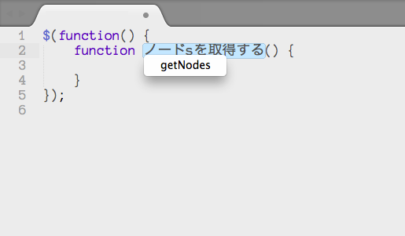

# Codic Sublime Text Plugin
Sublime text から [codic](https://codic.jp/) の機能を呼び出すプラグインです。

## インストール
いまの所Package Control には対応していません。以下の手順で、Githubからインストールしてください。

1. コマンドパレット → "Package Control: Add Repository" を選択し、以下のURLを追加。
 
 `https://github.com/codic-project/codic-sublime-plugin`

2. コマンドパレット "Package Control: Install Package"、「codic-sublime-plugin」を選択し、インストール。

※ コマンドパレットは、ツールメニューまたは、<kbd>Ctrl</kbd>+<kbd>Shift</kbd>+<kbd>P</kbd>

## 設定
メインメニュー ツール (Tools) → Codic → Access Token からアクセストークンを設定してください。
アクセストークンは、[codic](https://codic.jp/)にサインアップ後、APIステータスのページより取得できます。

## 使い方
テキストを選択し、メインメニューの Tool → Generate Naming あるいは、右クリックメニューから変換できます。
ショートカット: <kbd>Ctrl</kbd>+<kbd>Shift</kbd>+<kbd>D</kbd>

## その他コマンド
プロジェクトの変更は、メインメニューの Tool → Select Project からできます。

## その他
codicのプラグインは、他にも以下があります。基本的には同じAPIを使っているので機能に違いはありせんので、
使い易いヤツを選んでください。

- <https://github.com/naoyukik/SublimeCodic> - 高機能
- <https://github.com/airtoxin/codic-sublime> - Package Controlに対応

## 履歴
### 1.1 
- メインメニュー、右クリックメニューに対応
- ネーミング候補にレターケースの設定オプションを追加

### 1.0
- 最初のリリース

## TODO
- Supports Multi-selection / Multiline selection.
- airtoxin さんのプラグインに合流
